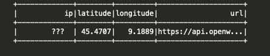
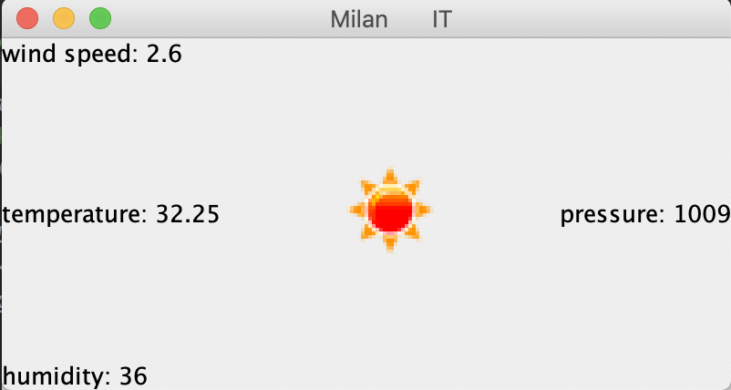

## Weather Info ##

#### How : ####

1) The application makes a GET call to a public API that returns IP and location information
2) analyzes the data with Spark and adds a URL column

3) I will need the URL column to call a second public service
   given latitude and longitude which will return the weather information.

4) analyze the weather information received with spark 
5) I expose the result with Swing (very simply) only for a visual matter.

#### Result: ####

#### Why: ####
I introduced spark for a training, to improvement my skill with (dataSet and dataFrame)

you could expand this functionality for many IP addresses (the correct use of spark)
